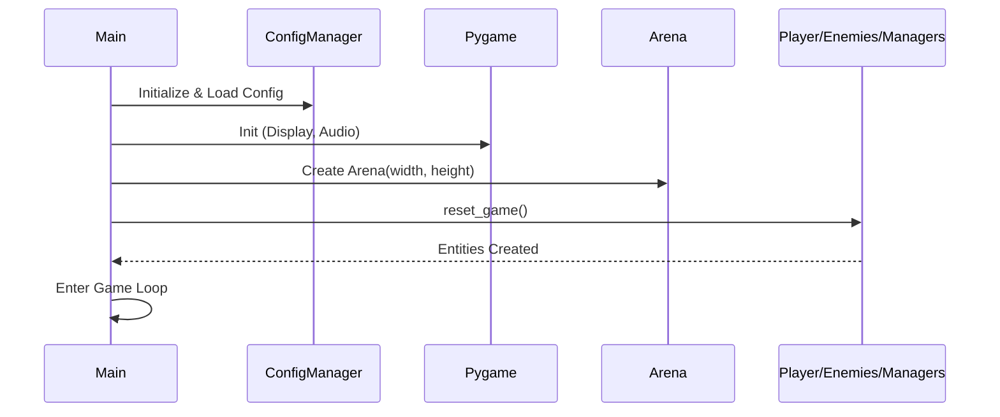
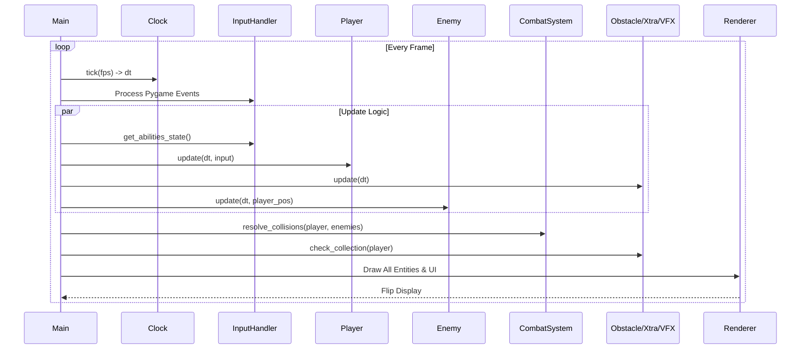
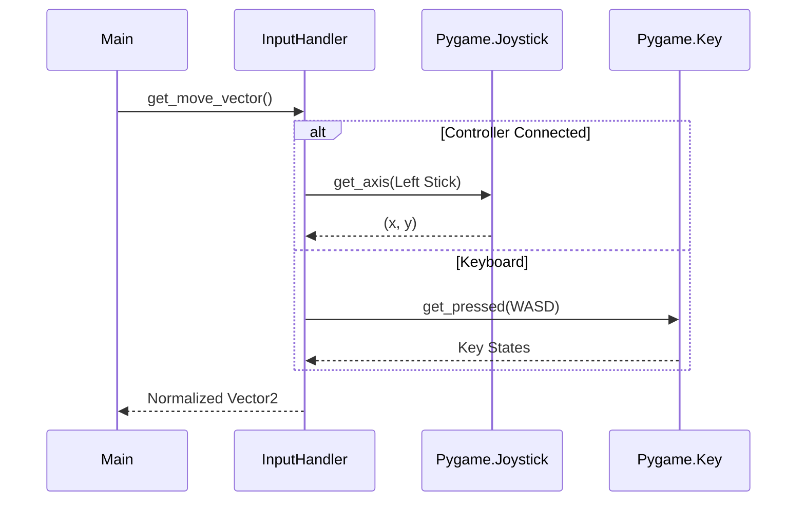
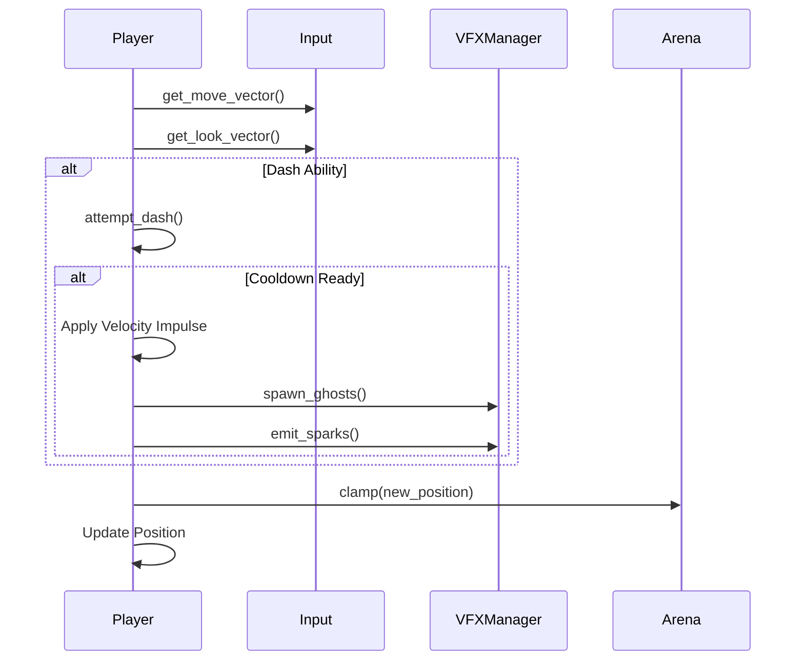
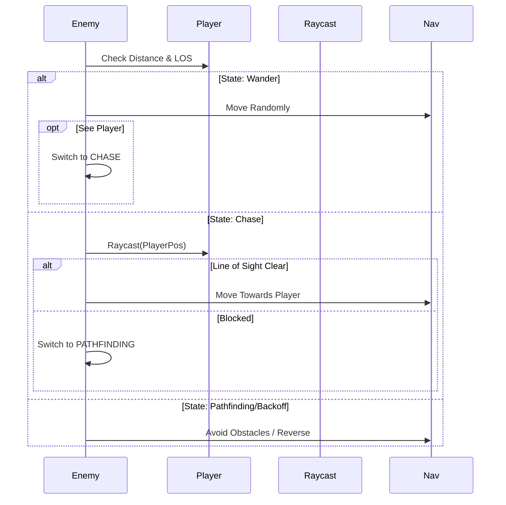
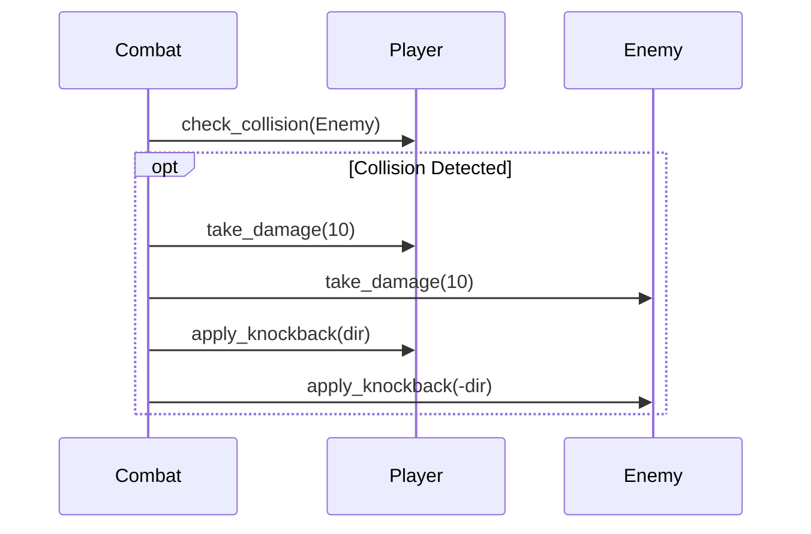

# Level Maze - Game Design Document

**Version:** 1.9
**Status:** In Development

## 1. Game Overview
**Level Maze** is a top-down action game where players navigate a series of maze-like arenas, evading enemies and finding the exit. The game emphasizes spatial awareness, precise movement, and stealth/evasion tactics against line-of-sight based enemies.

## 2. Core Gameplay Mechanics

### 2.1 Perspective
*   **View:** Top-down (Bird's-eye view).
*   **Camera:** Fixed on the arena.

### 2.2 Controls
Controls are **fully configurable** via `config.yaml`. The defaults are listed below.

| Action | Gamepad Defaults (Xbox/Generic) | Keyboard & Mouse Defaults |
| :--- | :--- | :--- |
| **Move** | **Left Stick** | **W A S D** |
| **Look/Aim** | **Right Stick** | **Mouse Position** |
| **Dash** | **B / Circle** (Button 1) | **Space** |
| **Roar** | **X / Square** (Button 2) | **Left Shift** |
| **Pause / Resume** | **Start / Menu** (Button 7) or **Select** (Button 6) | **Tab / Esc** |
| **Menu Nav** | **D-Pad / Left Stick** | **W / S / Up / Down** |
| **Menu Select**| **A / Cross** | **Enter / Space** |

### 2.3 Combat & Physics Interactions
*   **Health Points (HP):**
    *   **Player:** Starts with 100 HP.
    *   **Enemies:** Start with finite HP.
*   **Collision & Damage Rules:**
    *   **Player vs. Enemy:**
        *   **Damage:** **Both** entities take **10 Damage** upon contact.
        *   **Knockback:** Both entities are repelled away from each other with significant force (500 units).
        *   **Cooldown:** A 0.5s internal cooldown prevents rapid multi-frame collision processing.
    *   **Entity vs. Environment:**
        *   **Walls/Obstacles:** Entities slide along walls. No damage is taken.
        *   **Bounce:** AI has logic to "bounce" or redirect if stuck against a wall.

## 3. Game Elements

### 3.1 The Player
*   **Visuals:** Blue circle with a direction arrow.
*   **Progression:**
    *   **XP System:** 
        *   +50 XP per Enemy Kill.
        *   Level Up restores HP and reduces Ability Cooldowns by 10%.
*   **Abilities:**
    *   **1. Dash:**
        *   **Effect:** Rapid movement in facing direction. Leaves a trail of "ghost" sprites and spark particles.
        *   **Cooldown:** **10 Seconds** (Base).
        *   **Trigger:** Grants temporary invulnerability frame logic (Visual feedback: Cyan trail).
    *   **2. Roar:**
        *   **Effect:** Emits a multi-ring shockwave that pushes all nearby enemies away.
        *   **Visuals:** Glowing orange expanding rings.
        *   **Force:** Strong directional knockback to enemies within radius.
        *   **Cooldown:** **30 Seconds** (Base).

### 3.2 The Arena
*   **Structure:** Rectangular bounded area (Brick texture).
*   **Safe Zones:**
    *   **Player Spawn:** Center of arena.
    *   **Enemy Spawns:** Random locations with padding, ensuring no overlap with player safe zone or obstacles.

### 3.3 Obstacles
*   **Appearance:** Rectangular blocks (Brick texture).
*   **Generation:**
    *   Randomly placed with minimum gap guarantees to prevent "traps".
    *   Check for overlap with player safe zone.

### 3.4 Enemies
*   **Visuals:** Red circle with direction indicator.
*   **AI States:**
    1.  **Wander:** Random movement when player is not seen.
    2.  **Chase:** Direct pursuit when having Line of Sight.
    3.  **Pathfinding/Investigate:** Navigates around obstacles if blocked.
    4.  **Backoff:** If stuck or colliding frequently, attempts to reverse/randomize direction.
*   **Spawn Logic:**
    *   Count is configurable in `config.yaml`.
    *   Hard collision checks prevent spawning inside walls.

### 3.5 Xtras (Power-ups)
*   **Spawning:**
    *   Appears periodically (Every 5-15 seconds).
    *   Despawns if not collected after 10 seconds.
*   **Items:**
    *   **Health Pack:**
        *   **Player:** Restores **50 HP**.
        *   **Enemy:** Restores **25 HP** (Enemies can steal health packs!).

### 3.6 User Interface (UI)
*   **HUD:**
    *   **Health Bar:** Red/Green bar above player.
    *   **XP Bar:** Yellow bar above player.
    *   **Cooldowns:** Blue (Dash) and Orange (Roar) bars indicating recharge status.
*   **Pause Menu:**
    *   **Triggers:** Manual (Tab/Select/Start), Player Death, or Victory (All enemies dead).
    *   **Overlay:** Semi-transparent dark overlay.
    *   **Options:** 
        *   **Resume:** Return to game (if alive). Can also press Start/Select.
        *   **Restart:** Resets the entire game state (New level generation).
        *   **Exit:** Quits the application.

## 4. Configuration
The game uses `level_maze/config.yaml` for tuning:
*   **Window:** Width, Height, FPS, Title.
*   **Abilities:** Cooldowns and multipliers.
*   **Enemies:** Spawn count (`enemies.count`).
*   **Controls:** define Button IDs and Key Names for Dash and Roar.

## 5. Technical Systems
*   **VFX Manager:** Handles particle systems (sparks, bursts) and additive blending effects (trails, shockwaves).
*   **Combat System:** Centralized resolution for collisions, damage application, and knockback physics.
*   **Obstacle/Xtra Managers:** dedicated classes for procedural generation and lifecycle management.
*   **Input Handler:** Loads control mappings from `config.yaml` and supports gamepad/keyboard hot-swapping.

## 6. System Diagrams

### 6.1 Game Initialization (Main)

### 6.2 Game Loop & Update Cycle

### 6.3 Input Handling Flow

### 6.4 Player Action Logic

### 6.5 Enemy AI Behavior

### 6.6 Combat Resolution

